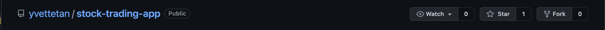

<div id="top"></div>
<!-- PROJECT SHIELDS -->
<!--
*** See the bottom of this document for the declaration of the reference variables
*** for contributors-url, forks-url, etc. This is an optional, concise syntax you may use.
*** https://www.markdownguide.org/basic-syntax/#reference-style-links
-->

[![Contributors][contributors-shield]][contributors-url]
[![Forks][forks-shield]][forks-url]
[![Stargazers][stars-shield]][stars-url]
[![Issues][issues-shield]][issues-url]

<!-- PROJECT LOGO -->
<br />
<div align='center'>
  <a href='https://github.com/yvettetan/stock-trading-app'>
    
  </a>

  <h3 align='center'>Stock Trading App</h3>

  <p align='center'>
    A mock Stock Trading App built with Ruby on Rails.
    <br />
    <a href='https://github.com/yvettetan/stock-trading-app'><strong>Explore the docs »</strong></a>
    <br />
    <br />
    <a href='http://stockit1.herokuapp.com/'>View Demo</a>
    ·
    <a href='https://github.com/yvettetan/stock-trading-app/issues'>Report Bug</a>
    ·
    <a href='https://github.com/yvettetan/stock-trading-app/issues'>Request Feature</a>
  </p>
</div>

<!-- TABLE OF CONTENTS -->
<details>
  <summary>Table of Contents</summary>
  <ol>
    <li>
      <a href="#about-the-project">About The Project</a>
      <ul>
        <li><a href="#built-with">Built With</a></li>
      </ul>
    </li>
    <li>
      <a href="#getting-started">Getting Started</a>
      <ul>
        <li><a href="#version">Version</a></li>
        <li><a href="#installation">Installation</a></li>
      </ul>
    </li>
    <!-- <li><a href="#usage">Usage</a></li> -->
    <li><a href="#contributing">Contributing</a></li>
    <li><a href="#contact">Contact</a></li>
  </ol>
</details>

<!-- ABOUT THE PROJECT -->

## About The Project

[![Product Name Screen Shot][product-screenshot]](http://stockit1.herokuapp.com)

A Ruby on Rails web app which utilizes the Ruby IEX gem which allows users to create accounts to sign in as buyers or brokers, which have their respective functionalities.

Has the following features:

- Utilized the IEX Gem to retrieve company information and the latest real-time stock prices.
- Implemented an admin dashboard to approve new broker accounts.
- Allowed users to create accounts to sign in as buyers or brokers, which have their respective functionalities.
- Added a stock search feature using AJAX, to allow brokers to find listed companies to add to their portfolio.
- Enabled buyers and brokers to view their individual transaction history.
- Admin accounts are configured through the Seed file.
- Uses Devise for user authentication.
- Implements 40+ Rspec for TDD consisting of system, request and model specs. Integrates Factory Bot for the creation of sample data.

<p align="right">(<a href="#top">back to top</a>)</p>

### Built With

- [Ruby on Rails](https://rubyonrails.org/)
- [PostgreSQL](https://www.postgresql.org/)
- [Bootstrap](https://getbootstrap.com)
- [Vanilla Javasript](https://www.javascript.com/)

<p align="right">(<a href="#top">back to top</a>)</p>

<!-- GETTING STARTED -->

## Getting Started

## Version

```
  Ruby 2.7.2
  Rails 6.0.3.4
  NodeJS 12.18.3
  Yarn 1.22.4
```

### Installation

1. Get a free API Key at [IEXCloud.io](https://iexcloud.io/)
   Fork this repo:
   

Then, clone your forked repo to your machine

```
  $ git clone git@github.com:<username>/stock-trading-app.git <name of your app>
  $ cd <name of your app>
```

#### Setup

```
  $ bundle install
  $ rake db:setup
```

#### Starting the application

```
  $ rails server
```

#### How to run the test suite

```
  $ rspec
```

#### How to run the Ruby Linter

```
  $ rubocop
```

<p align="right">(<a href="#top">back to top</a>)</p>

<!-- CONTRIBUTING -->

## Contributing

Contributions are what make the open source community such an amazing place to learn, inspire, and create. Any contributions you make are **greatly appreciated**.

If you have a suggestion that would make this better, please fork the repo and create a pull request. You can also simply open an issue with the tag "enhancement".
Don't forget to give the project a star! Thanks again!

1. Fork the Project
2. Create your Feature Branch (`git checkout -b feature/AmazingFeature`)
3. Commit your Changes (`git commit -m 'Add some AmazingFeature'`)
4. Push to the Branch (`git push origin feature/AmazingFeature`)
5. Open a Pull Request

<p align="right">(<a href="#top">back to top</a>)</p>

<!-- CONTACT -->

## Contact

Yvette Tan - [LinkedIn](https://www.linkedin.com/in/yvettedytan/)
Lea Tinoso - [LinkedIn](https://www.linkedin.com/in/lealynltinoso/)

<p align="right">(<a href="#top">back to top</a>)</p>

<!-- MARKDOWN LINKS & IMAGES -->
<!-- https://www.markdownguide.org/basic-syntax/#reference-style-links -->

[contributors-shield]: https://img.shields.io/github/contributors/yvettetan/stock-trading-app.svg?style=for-the-badge
[contributors-url]: https://github.com/yvettetan/stock-trading-app/graphs/contributors
[forks-shield]: https://img.shields.io/github/forks/yvettetan/stock-trading-app.svg?style=for-the-badge
[forks-url]: https://github.com/yvettetan/stock-trading-app/network/members
[stars-shield]: https://img.shields.io/github/stars/yvettetan/stock-trading-app.svg?style=for-the-badge
[stars-url]: https://github.com/yvettetan/stock-trading-app/stargazers
[issues-shield]: https://img.shields.io/github/issues/yvettetan/stock-trading-app.svg?style=for-the-badge
[issues-url]: https://github.com/yvettetan/stock-trading-app/issues
[product-screenshot]: images/landing-page.png
